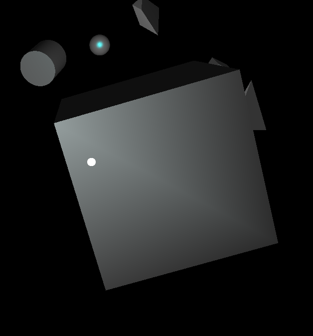
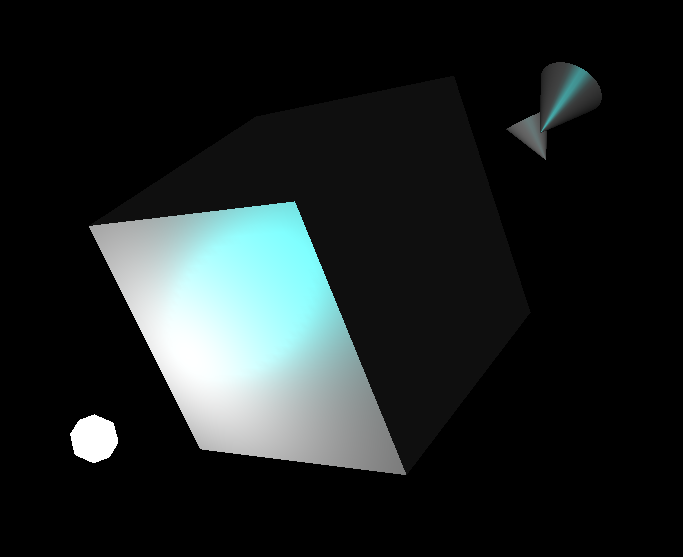
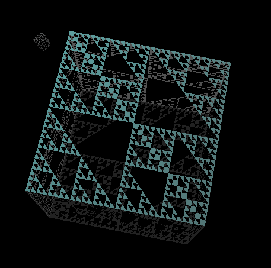

## 课程设计报告

2019 - 2020 学年春夏学期 《计算机图形学》

张海川 3180105353

章可循 3180104920

范安东 3180103126

### 实现功能

* 具有基本体素（立方体、球、圆柱、圆锥、多面棱柱、多面棱台）的建模表达能力
  * 曲面细分实现
* 具有基本 OBJ 三维网格导入导出功能
* 具有基本材质、纹理的显示和编辑能力
  * 可运行时调整材质、选择纹理
* 具有基本几何变换功能
  * 旋转、平移、缩放
* 基本光照明模型，具有基本的光源编辑能力
  * 可运行时调整光源的位置、开关
* 能对建模后场景进行漫游
  * 具有 Zoom In/Out, Pan, Orbit, Zoom To Fit 等观察功能
* 提供屏幕截取/保存功能
* Nurbs 建模
  * 根据数学原理手工实现

### 交互说明

* 运行 `main.exe` 来体验我们的课程设计。

* 按下鼠标左键并拖动以改变观察方向（Pan）。
* 使用 `WASDZC ` 在场景中前后左右**下上**移动。
* 按下 `K` 以开启/关闭光照模型。
* 物体/光源被中央的准心瞄准后，会被白色框标记。按下空格来选中它，再次按下空格取消选择。
  * 观察与移动
    * 选中后按住 `G` 来抓持物体/光源。这时物体会跟随观察者移动。
    * 选中后按住 `F` 来 orbit 观察这个物体/光源。拖动鼠标或操作 `WASD` 沿轨道观察物体/光源。
    * 选中后按下 `R` 来移动到观察物体/光源的合适位置（Zoom to fit）。
  * 纹理与材质编辑
    * 选中后按下 `T` ，选择一张 PNG 图片作为物体的纹理。再次按下 `T` 以清除纹理。
    * 选中后使用 `V` `B` 键来增加/减小物体的漫反射光强度。
    * 选中后使用 `N` `M` 键来增加/减小物体的环境光强度。
    * 选中后使用 `H` `J` 键来增加/减小物体的镜面反射光强度。
  * 变换
    * 选中后使用方向键、`,` `.` 键盘使物体/光源发生平移变换。
    * 选中后使用 `U` `I` `O` 键使物体/光源以 X/Y/Z 为轴发生旋转变换。
    * 选中后使用 `-` `=` 键使物体发生缩放变换。
  * 光源编辑
    * 选中一个光源后，按下 `L` 来开启/关闭这个光源。
* 按住 `P` ，此时按住鼠标左键并拖动鼠标可以选框截图。
  * 截图会被存放在可执行文件同一目录下。
* 控制台每秒输出一次当前 FPS 值。
* 按下 `E` 导出当前所有 OBJ 模型组成的场景。
  * 将被保存为 `export.obj`，放置在可执行文件同一目录下。
  * 运行 `main_open_exportedOBJ.exe` 来查看导出模型重新导入后在场景中的效果。

### 实现思路与代码分析

#### 总体框架设计

麻雀虽小，五脏俱全。我们的项目整体上基于一个场景图（scene graph）的架构进行实现，其中，世界中的每一个物体都是一个`node`对象，其核心代码如下：（省略了部分代码，具体请见[`scene_graph.h`](scene_graph.h)）

```c++
class node {
    protected:
            void transform();
            virtual void colorize();

    public:
        // transformation
        GLfloat translate[3]      = { 0.0f, 0.0f, 0.0f };
        GLfloat scale[3]          = { 1.0f, 1.0f, 1.0f };
        GLfloat center[3]         = { 0.0f, 0.0f, 0.0f };
        mat3    rotate_mat        = mat3::identity();

        // material
        std::shared_ptr<material> mtrl;

        // scene
        const std::string type    = "node";
        bool interactive          = true;
        bool visible              = true;

        virtual void update();
        virtual void render();
};
```

简单地说，每个`node`具有其位置、缩放和旋转（使用一个矩阵表示），它们决定了一个`node`的内部坐标系如何变换到世界坐标系；同时，每个`node`提供`update()`方法，负责更新其数据、以及`render()`方法，负责渲染对象本身。

这样做是为了解决图形学（尤其是在这样一个类似于游戏的需求中）里的一些常见问题：

1. 首先，`OpenGL`的API大量使用了状态机，其状态难以追踪，因此需要通过对其API进行封装，由框架维护`OpenGL`状态机的状态，并对外提供某种声明式的接口，从而降低各个模块之间的耦合程度，降低开发者的心智负担。在我们的框架中，矩阵变换以及材质设置分别通过`transform()`和`colorize()`函数进行封装，保证了其实现的正确性、防止对其他元素的渲染产生干扰，同时使得子类的实现变得十分简便。这样的封装也在其他许多地方有所体现，比如将材质抽象为[`material`类](material.h)等。
2. 其次，`OpenGL`作为一款相对底层的图形API，并不能处理所有的高级任务，比如我们项目中用到的“光线追踪”（从观察者的角度发出一束光线，找到这条线上遇到的第一个物体），就必须自己编写代码——而不是调用API——来实现。如果不使用框架、要求元素将位置写入`translate`等公有参数中，则会造成严重的代码耦合和数据冗余问题。这里，我们通过`node`类，定义了一个所有节点的**最小公共接口**，从而有效地解决了这些问题。
3. 除此之外，场景图所提供的抽象，也允许我们进行进一步的优化——比如在我们的项目中，要求每种节点提供其AABB（*Axis-Aligned Bounding Box*，坐标轴对齐包络盒），用于选中对象并显示选中框。实际上，这一抽象还能有更多价值，比如可以构建一棵八叉树（而不是简单地使用`vector`）、从而对视锥体外的对象进行消隐，大大加速场景渲染。当然，由于我们的项目尚未达到此等复杂程度，这样的优化只会成为overkill而已。
4. 最后，场景图提供了一套行之有效的生命周期管理，比如每个`node`应当在其构造函数中进行初始化（此时`glut`已经完成`OpenGL`上下文的初始化），然后在`update()`中进行逻辑更新（此时不保证`OpenGL`状态机的状态），最后在`render()`中进行绘制（此时所有的`update()`均已执行完毕，并且保证对象坐标系变换到视坐标系等）。这也有助于各个模块的实现者做出合理、可靠、高效的实现，减少可能出现的问题。

综上，我们的项目建立在一系列抽象上——节点`node`、场景图`scene_graph`、光源`light`、控制器`control`、摄像机`camera`……它们是其他一切的基础，是各种复杂功能背后那坚实的后盾。

#### 场景漫游

场景漫游首先是键盘控制摄像机移动——这再简单不过了，稍微复杂一点的是转动视角：在按下鼠标时记录当前的鼠标位置，接着根据鼠标的相对位置更改视角，常见的做法是使用[欧拉角](https://en.wikipedia.org/wiki/Euler_angles) ，不过屏幕只有两个维度，而欧拉角有三个，好在人类视角一般不需要`roll`轴，因此只需要处理`yaw`和`pitch`即可。

我们可以看[`control.h`](control.h)中`control`类的代码：

```c++
class orbit_control : public control {
    private:
        float alpha = 0.0f;
        float beta  = 0.0f;
        float x     = 0.0f;
        float y     = 0.0f;
        float z     = 0.0f;

        void move(float angle, float dist);
    public:
        void update() override;
        ray get_ray() override;
};
```

这里的`alpha`和`beta`两个字段就分别对应了`yaw`和`pitch`的角度，`x`、`y`和`z`则是摄像机当前的位置，需要注意在`OpenGL`中进行变换的顺序：

```c++
glRotatef(beta, 1.0f, 0.0f, 0.0f);
glRotatef(alpha, 0.0f, 1.0f, 0.0f);
glTranslatef(-x, -y, -z);
```

这是因为，逻辑上先平移再旋转，旋转则是先`yaw`再`pitch`，同时`OpenGL`中的矩阵操作是右乘（使用列向量），因此顺序需要反过来。

这一串矩阵变换，实际上描述了**从世界坐标系到视点坐标**的变换，如果我们在视点坐标中取一组基（比如三个轴上的单位向量），并用这串矩阵的逆矩阵进行变换，就可以得到它们在世界坐标中的结果。当我们按下`WASD`键进行位移时，我们也可以用这种方法使得摄像机相对当前视角进行移动，得到良好的漫游效果。

最后，我们还实现了一个十分有趣的应用：选中物体，在视角旋转的过程中保证物体的位置（和角度）完全稳定。分解开来，这需要物体在视角改变前后满足两个条件：

1. 物体的中心位置相对视点坐标不变。
2. 物体的旋转矩阵相对视点坐标不变。

事实上，如果采用四元数的描述方法，这两个条件也可以合成为一个条件。通过上述方法我们可以得到新旧两个**世界坐标到视点坐标**的变换矩阵，我们将物体的（世界坐标下的）中心位置以及旋转矩阵乘上旧矩阵、再乘上新矩阵的逆矩阵，就能够达成这一效果。代码如下：

```c++
auto ro = mat3::rotate(g_down_beta, 1.0f, 0.0f, 0.0f) * mat3::rotate(g_down_alpha, 0.0f, 1.0f, 0.0f);
auto rn = mat3::rotate(beta, 1.0f, 0.0f, 0.0f) * mat3::rotate(alpha, 0.0f, 1.0f, 0.0f);
// dp in world
vec3 dpo = {
        down_pos[_x] - down_ray.x0,
        down_pos[_y] - down_ray.y0,
        down_pos[_z] - down_ray.z0
};
vec3 dpn = ~rn * ro * dpo;
// back to node
down_node->translate[_x] = r.x0 + dpn.data[_x];
down_node->translate[_y] = r.y0 + dpn.data[_y];
down_node->translate[_z] = r.z0 + dpn.data[_z];
down_node->rotate_mat = ~rn * ro * down_mat;
```

#### 体素构建

根据要求，我们需要建出立方体、球、圆柱、圆锥、多面棱柱、多面棱台这六种基本体素。如前一部分所属，以上所有体素都是 `node` 类的子类。因此对于每一个体素类，只需要重载 `node` 类中的 `render()` 方法即可实现体素的构建与渲染。代码的形式如下。

```cpp
class someGeometry : public node {
  	someGeometry() {
      	// do some initialization here
    }
  	void render() override {
      	transform();
      	colorize();
      	// render this geometry
    }
}
```

对于每一种体素，在渲染时首先需要调用父类方法 `transform()` 与 `colorize()`。`transform()` 使用 OpenGL API `glTranslate` `glScale` `glMultMatrixf` 等进行（此处我们手工实现了矩阵旋转，故使用 `glMultMatrixf` 将旋转矩阵乘在体素坐标上）。注意顺序是先平移、再旋转，最后缩放。`colorize()` 处理纹理、颜色、材质的设置。如果体素具有某种属性，则调用 OpenGL API 进行相应设置，例如使用 `glBindTexture` 将纹理与体素绑定。

此后就可以开始绘制当前体素。由于我们需要让每种体素支持贴图，不能使用 glut 提供的绘制 API （`glutSolid*` 没有提供纹理坐标）。对于立方体、棱柱、棱台，我们使用 `glVertex` API 指定端点来进行绘制。绘制时同时指定纹理坐标与平面法向（确保光照正确）。对于球、圆柱、圆锥，我们使用 `gluQuadric` API 进行绘制，这些 API 提供的体素带有纹理坐标。使用这一套 API，首先需要在体素的构造函数中调用 `gluNewQuadric() `申请绘制体素每一个面的内存空间，随后调用 API 设置体素每一个面的法向、纹理、绘制方式等。渲染时调用 API 将体素绘制出即可，例如，绘制圆柱时，首先使用 `gluCylinder` 绘制圆柱面，然后使用 `gluDisk` 绘制圆柱顶面与底面。在体素对象析构的时候，需要释放申请过的体素内存空间。

对于每一个体素类，由于需要不停重复绘制，我们可以使用显示列表技术来加速渲染。只需在构造函数中建立显示列表，渲染时调用显示列表，对象析构时删除显示列表即可。

#### 曲面细分

考虑到与课堂内容的衔接，我们在本次项目中主要使用了legacy OpenGL进行编写，然而，legacy OpenGL的固定渲染管线仅在顶点层面处理光照，即[*Gouraud Shading*](https://en.wikipedia.org/wiki/Gouraud_shading) ，效果并不很好，比如下图：



图中，方块的表面上明显出现了一条斜线，这是因为整个面只有两个三角形，无法有效处理高光等对于位置非线性的光照结果。

解决方法也很简单：将每个表面分拆成多块，人为提高计算光照的密度，从而制造高得多的精度，如图：



图中是将每个表面拆成约一千个表面的结果，可以看出，光照的计算结果已经十分接近逐片元着色（即[*Phong Shading*](https://en.wikipedia.org/wiki/Phong_shading) 的结果了。

事实上，这一细分的工作原理并不复杂，倒是工程实现更具挑战性一些。核心代码如下：

```c++
#define TESSELLATE
#ifdef TESSELLATE

#define GRANULARITY 5

GLenum mode;
GLfloat normal[3]   = {};

class vertex {
public:
    GLfloat position[3] = {};
    GLdouble tex[2]     = {};
};
typedef std::array<float, 3> point;

std::array<vertex, 4> vertices;
int pointer = {};

void tes_glBegin(GLenum _mode) {
    glBegin(GL_TRIANGLES);
    mode = _mode;
    pointer = 0;
}

void tes_glEnd() {/* omitted */}
void tes_glNormal3fv(const GLfloat arr[]) {/* omitted */}
void tes_glNormal3f(GLfloat a, GLfloat b, GLfloat c) {/* omitted */}
void tes_glTexCoord2d(GLdouble u, GLdouble v) {/* omitted */}

void tes_glVertex3fv(const GLfloat arr[]) {
    std::memcpy(vertices[pointer].position, arr, sizeof(GLfloat) * 3);
    ++pointer;
    switch (mode) {
        case GL_TRIANGLES:
            if (pointer == 3) {
                tessellate(0, 1, 2);
                pointer = 0;
            }
            break;
        case GL_QUADS:
            if (pointer == 3) {
                tessellate(0, 1, 2);
            } else if (pointer == 4) {
                tessellate(2, 3, 0);
                pointer = 0;
            }
            break;
        default: break;
    }
}

void tes_glVertex3f(GLfloat x, GLfloat y, GLfloat z) {/* omitted */}
template <typename T, size_t n>
std::array<T, n> interpolate(std::array<T, n> a, std::array<T, n> b, float t) {/* omitted */}
template <typename T, size_t n>
std::array<T, n> sum(const T a[], const T b[], const T c[], point p) {/* omitted */}
void nail(int a, int b, int c, point p) {/* omitted */}

void fractal(int level, int a, int b, int c, point q, point w, point e) {
    if (level != GRANULARITY) {
        point qw = interpolate(q, w, 0.5f);
        point we = interpolate(w, e, 0.5f);
        point eq = interpolate(e, q, 0.5f);
        fractal(level + 1, a, b, c, eq, q, qw);
        fractal(level + 1, a, b, c, qw, w, we);
        fractal(level + 1, a, b, c, we, e, eq);
        fractal(level + 1, a, b, c, qw, we, eq);
    } else {
        nail(a, b, c, q);
        nail(a, b, c, w);
        nail(a, b, c, e);
    }
}

void tessellate(int a, int b, int c) {/* omitted */}

#define glBegin tes_glBegin
#define glEnd tes_glEnd
#define glNormal3fv tes_glNormal3fv
#define glNormal3f tes_glNormal3f
#define glTexCoord2d tes_glTexCoord2d
#define glVertex3fv tes_glVertex3fv
#define glVertex3f tes_glVertex3f
#endif
```

为了最小化对其他代码的影响，我们通过宏定义的方式重载了`glVertex3f()`等各个函数，在调用时缓存下参数，等一个面片（根据`mode`不同可能是`triangle`或`quad`）的参数齐备之后进行细分和插值。

对于插值，我们采用了分形的的技术，即递归地将一个三角形（对于`quad`则先将其拆成两个三角形）拆分成四个小三角形，直到达到规定的细分层数。我们可以通过隐藏中间的三角形来直观地看到细分效果：（密恐警告）



这样的做法更大的价值是他可以提供一种自适应的细分效果，即测算每个部分在视角中所占据的大小，根据是否够大决定是否进一步分形——当然，同样地，我们的项目尚未需要实现这种功能。

#### OBJ 网格导入与导出

OBJ 网格导入逻辑参考了[这份代码](http://openglsamples.sourceforge.net/files/glut_obj.cpp)。原理也较为简单，即解析 `v` 开头的一行读入端点坐标，解析 `f` 开头的一行将端点坐标按照面片的顺序紧密排列在数组中，同时计算面片的法向。最后调用 OpenGL API 以这些数组内的点作为顶点进行绘制即可。实现上，由于 OBJ 对象依然是一种“体素”，OBJ 类因此继承了 `node` 类。在 OBJ 类构造时即可执行 OBJ 文件解析的逻辑，将面片顶点数据储存在内存中。然后重载 `render()` 方法，调用 API 绘制即可。

OBJ 网格的导出需要保留场景中所有 OBJ 网格体素的位置与变换情况。因此，在输出内存中的 OBJ 对象面片数据之前，需要以当前 OBJ 对象的变换情况对顶点进行变换再输出，注意此处应为先缩放、再旋转，最后平移。

接受键盘消息，修改

#### 材质、纹理显示与编辑

物体的材质信息在对应的类中被保存。只需要在 `render()` 方法内使用 `glMaterial` API 对物体材质进行设置即可。对于材质的编辑，只需要接受键盘消息，调整对应的材质信息即可。

对于纹理的显示，我们首先需要按 PNG 文件的位置导入图片。导入图片使用了 [stb](https://github.com/nothings/stb) 库。随后调用 API，将导入的图片数据生成纹理，并将纹理的编号设置给物体对象。这样物体在渲染前就可以与纹理绑定，从而实现纹理的显示。

对于纹理的编辑，我们使用了 [Native File Dialog](https://github.com/mlabbe/nativefiledialog) 这一跨平台文件选择库（支持 Windows、macOS、Linux），使用库获取用户指定 PNG 文件的路径，并以该路径对应的图片生成纹理，将物体对象的纹理编号修改即可。

#### 几何变换

几何变换功能主要在 `transformation` 类中实现，它是 `listener` 和 `actor`  的子类。通过对方向键、`,` `.` `U` `I`   `O` 按下和抬起的监听，它给代表每个操作的成员变量赋值。

通过重写 `update` 来实现变换。通过 `scene_graph` 对象获得当前选中的体素。通过 `orbit_control` 对象获取观察者观察的视线方向，根据这个视线方向计算出相对于该方向的坐标系 X 轴 Y 轴 Z 轴方向，从而实现相对于观察方向的位移和旋转。对于每个正在进行的平移变换，在其对应的移动方向上移动一小段距离，因此如果同时按下多个方向键，平移的方向是对应的各个方向的向量和。调用 mat3 类中的 rotate 方法构造旋转矩阵实现旋转。直接修改 node 类的 scale 参数实现缩放。

####  光照模型

光照模型功能主要通过 `light` `light_env` 类实现。

`light_env` 是  `actor` 和 `listener`  的子类，用于给新创建的光源分配 OpenGL 中的枚举量（如 GL_LIGHT0）、接受用户键盘的输入开关某个光源或整个光照模型、调节光源的信息等。

`light`  是 `node`  的子类，用于存储某个特定光源的信息。它有两个子类 `point_light` 和 `spotlight`，分别用于 存储点光源和聚光灯，通过重写 `node` 的 `update` 和  `render`，调用 OpenGL 中的 `glLight` 相关函数来实现光照的效果。

由于 `light` 是 `node` 的子类，选中并调整位置的功能对光源同样适用。在光源的 `render`  方法中，调用 `glutSolidSphere` 来绘制一个小型球体来代表光源，方便使用者调节光源的位置。

#### 屏幕截取

屏幕截取功能主要在 `screenshot` 类中实现，它是 `listener` 的一个子类。通过键盘事件判断，当 `P` 被按下时，进入屏幕截取模式。

在屏幕截取模式下，用于标注被选中物体的选框不会被绘制。

在屏幕截取模式下，鼠标按下时，通过鼠标点击的位置获取所截取区域的一个顶点，鼠标移动时根据鼠标所处的位置获取所截取区域的另一个顶点。每次 `redraw` 都根据截取区域的两个顶点绘制当前选取的区域。鼠标放开时，调用 `glReadPixels` 获取区域内的像素信息，并使用 [stb](https://github.com/nothings/stb) 库将其输出为位图 。

#### Nurbs 建模

Nurbs 建模功能主要在 `nurbs` 类中实现，它是 `node` 的一个子类，除了 `node` 的成员变量以外，它的成员变量还包含了控制点坐标、B 样条节点位置、B 样条度数、三维网格的精细程度等信息，以供建模者自由调节 nurbs 曲面的形状。

Nurbs 建模主要包括 B 样条基函数的计算和给定位置求点坐标两个部分。

当节点为 $u_0,u_1,u_2,\dots,u_{n+p+1}$ 时，基函数的定义如下
$$
N_{i,0}=\left\{\begin{align}1,& &u_i\le u<u_{i+1} \\ 0, & &otherwise \end{align}\right.\\
N_{i,p}(u)=\frac{u-u_i}{u_{i+p}-u_i}N_{i,p-1}(u)+\frac{u_{i+p+1}-u}{u_{i+p+1}-u_{i+1}}N_{i+1,p-1}(u)\\
\frac{0}{0}=0
$$


依据定义求出  B 样条基函数。

nurbs 曲面的表达式为
$$
S(u, v)=\frac{\sum_{i=0}^{n}\sum_{j=0}^m N_{i,p}(u)N_{j,q}(v)w_iP_i}{\sum_{i=0}^{n}\sum_{j=0}^m N_{i,p}(u)N_{j,q}(v)w_i}=\frac{1}{\sum_{i=0}^{n}\sum_{j=0}^m N_{i,p}(u)N_{j,q}(v)w_i}\left(\begin{matrix}\sum\sum N_{i,p}N_{j,q}w_ix_i \\\sum\sum N_{i,p}N_{j,q}w_iy_i \\ \sum\sum N_{i,p}N_{j,q}w_iz_i \\ \sum\sum N_{i,p}N_{j,q}w_i\end{matrix}\right)
$$
注意到齐次坐标第四维和分母相同，因此在计算给定点的坐标时，只需要将笛卡尔坐标根据控制点权重转换为齐次坐标，使用普通的 B 样条的公式计算出所求点的齐次坐标，然后再转换回笛卡尔坐标即可。

在计算出三维网格中每个点的坐标后，用三角形面绘制 nurbs 曲面，并设置每个三角形面的法向量以实现较好的光照效果。为了让 nurbs 曲面双面都有光照的效果，将两个形状相同的曲面以极小的偏移量相邻叠放，并对于两个面中相对应的三角面设置相反的法向量。

### 分工

张海川：`scene_graph` 维护、glut 生命周期管理、项目框架设计与协调、曲面细分、运动控制

范安东：场景编辑、体素建模、纹理控制、OBJ 文件导入导出、展示视频剪辑

章可循：场景编辑、变换控制、光源控制、截图、Nurbs 建模、展示视频录制与配音

